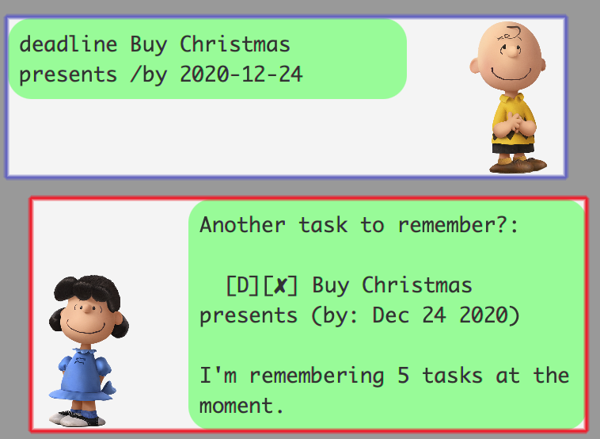
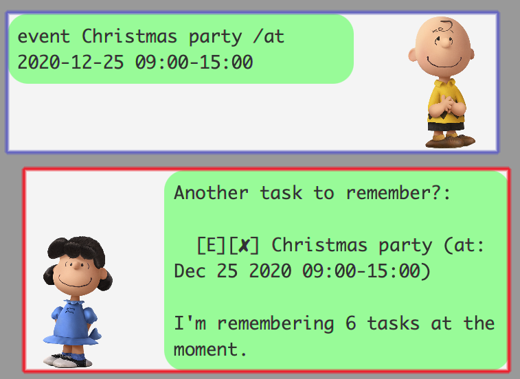
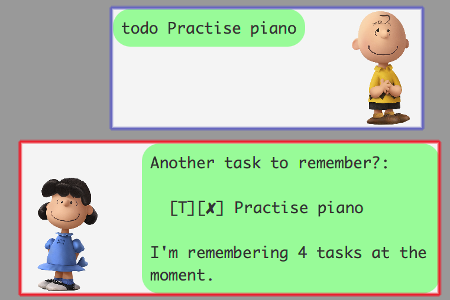
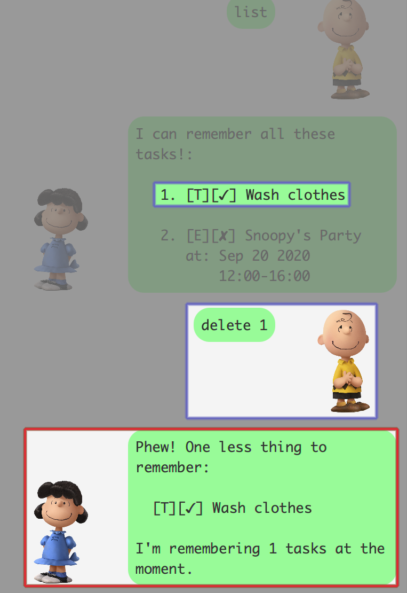
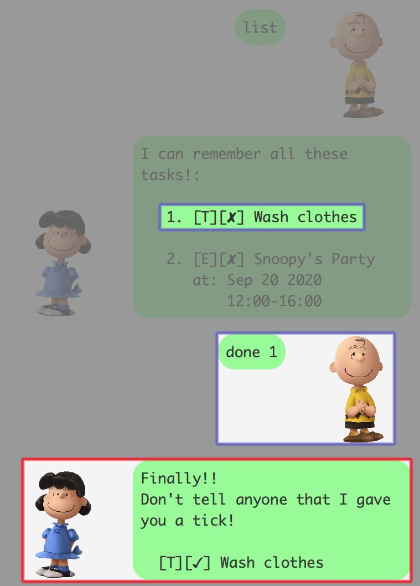
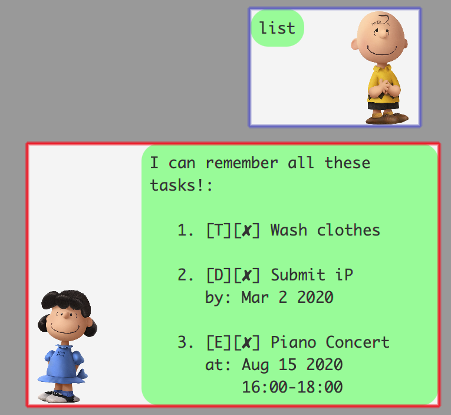
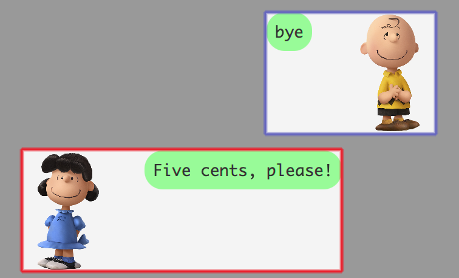

# User Guide
1. [Introduction](#1-introduction)
2. [Features](#2-features)
3. [Usage](#3-usage)
    1. [`deadline` - Add a deadline](#deadline---add-a-deadline)
    2. [`event` - Add an event](#event---add-an-event)
    3. [`todo` - Add a todo](#todo---add-a-todo)
    4. [`delete` - Delete a task](#delete---delete-a-task)
    5. [`done` - Mark a task as done](#done---mark-a-task-as-done)
    6. [`find` - Find tasks by keyword](#find---find-tasks-by-keyword)
    7. [`list` - Display the task list](#list---display-the-task-list)
    8. [`bye` - End the program](#bye---end-the-program)

## 1. Introduction
Duke is a light-weight task organiser, helping users to keep track of their deadlines, events, and daily tasks.
In addition, all tasks that are managed by Duke are saved in a portable format so that users can easily upload or
transfer their tasks to any desktop platform!

## 2. Features
- Adding different types of tasks
    - Deadlines
    - Events
    - Todos
    
- Marking completed tasks
- Deleting tasks
- Finding tasks by keyword
- Automatically saving the task list in a save file
- Automatically Loading a task list from a save file

## 3. Usage

#### Command Format
- Each command begins with a keyword, followed by a number of compulsory parameters.

- Items in square brackets are compulsory parameters to be supplied by the user.
eg. in `todo Wake up!`, `Wake up!` fills in the `[description]` parameter of the command
that creates a todo (see `todo [description]`).

- Parameters are `CASE_SENSITIVE`, meaning that n

- `[date]` parameters must be supplied in the following format: `yyyy-mm-dd`. eg. `2020-12-25` for 25 Decemeber 2020.

- `[time]` parameters must be supplied in the following format: `h-ham/pm`. eg. `8-12pm`.
The time interval should be provided from earliest to latest. eg. `12-8am` is not supported.

&nbsp;
#### Task Descriptions
- All tasks types require a `description`.

- Descriptions are `CASE_SENSITIVE`, meaning
that the description that the user supplies will not be formatted.

- Two tasks cannot have the same description if they belong to the same type of task.

&nbsp;
#### Command List

### `deadline` - Add a deadline

Adds a deadline to the task list.
A deadline is a task that has a completion date,
which must be specified after the `/by` keyword.
\
\
Format: `deadline [description] /by [date]`

Example of usage: 

&nbsp;
### `event` - Add an event

Adds an event to the task list.
An event is a task that has a scheduled date and time interval,
which must be specified in that order after the `/at` keyword.
\
\
Format: `event [description] /at [date] [time]`

Example of usage: 

&nbsp;
### `todo` - Add a todo

Adds a todo to the task list.
A todo is a task that only has a description.
\
\
Format: `todo [description]`

Example of usage: 

&nbsp;
### `delete` - Delete a task

Removes a task from the task list by specifying their position in the current list.
To obtain the `[task id]` of the task to remove, use the `list` command.
\
\
Format: `delete [task id]`

Example of usage: 

&nbsp;
### `done` - Mark a task as done

Marks a task as done in the task list by specifying their position in the current list.
A tick should appear next to the description of the task if it has been marked as done correctly.
To obtain the `[task id]` of the task to mark as done, use the `list` command.
\
\
Format: `done [task id]`

Example of usage: 

&nbsp;
### `find` - Find tasks by keyword

Searches through the list of tasks, and displays all tasks that contain
the keyword in their description. The keyword used to search is `CASE_INSENSITVE`, meaning that
all the task descriptions and the keyword will be compared in `LOWER_CASE`.
\
\
Format: `find [keyword]`

Example of usage: 

&nbsp;
### `list` - Display the task list

Displays the list of tasks by ordering them numerically . Tasks will be listed in
the order that they were inserted into the list.
\
\
Format: `list`

Example of usage: 

&nbsp;
### `bye` - End the program

Finish managing the task list. The user can continue to input commands,
but they will not be processed. Duke must be restarted in order to process more commands.
\
\
Format: `bye`

Example of usage: 

